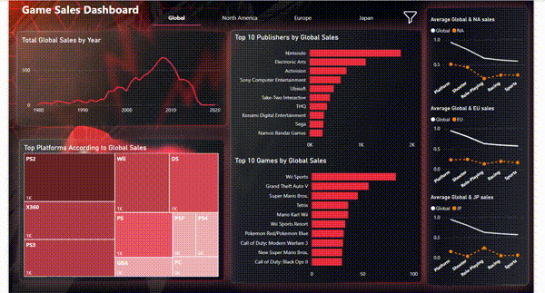

# 🎮 Game Sales Analysis Dashboard  
*Tech Stack: Power BI | Excel*

## 📊 Overview  
This project involves a **Power BI Dashboard** built to analyze video game sales data across **global**, **North American**, **European**, and **Japanese markets**. Designed with business stakeholders in mind, the dashboard provides actionable insights into market trends, top-performing games, and sales distribution by various dimensions.

## 🔑 Key Features  
- **Interactive Visualizations**  
  - Year-over-year sales trends.  
  - Top games analysis by **genre**, **platform**, and **publisher**.  
  - A leaderboard showcasing the **Top 10 games** based on sales performance.  

- **Dynamic User Interface**  
  - Interactive buttons for streamlined navigation.  
  - Filter panels for drill-down exploration by region, platform, and other dimensions.  

- **Enhanced User Experience**  
  - Tailored visual elements to improve data storytelling.  
  - Intuitive design to address business requirements and insights delivery.

## 📂 Files and Resources  
- **Power BI Dashboard File**: `.pbix` file for the dashboard visualization.  
- **Excel Data Source**: Raw data used for analysis and visualization preparation.  

## 🖼️ Preview  

